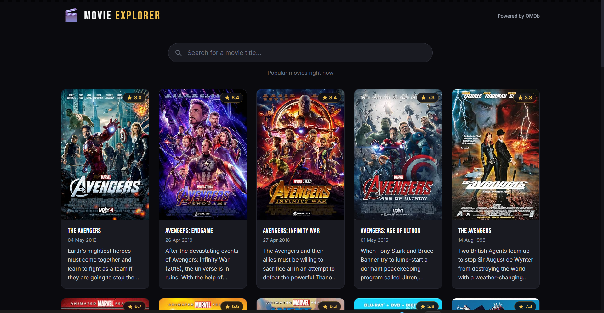
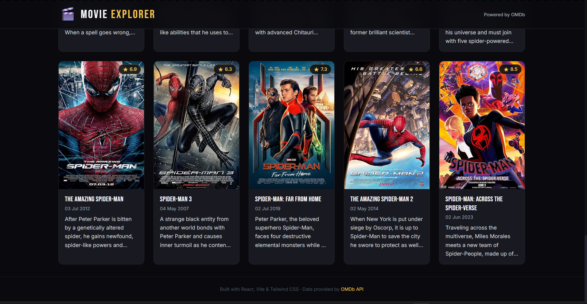

# 🎬 Movie Explorer

A responsive movie search app built with **React (Vite)**, **Tailwind CSS**, and **Axios**, powered by the [OMDb (Open Movie Database) API](https://www.omdbapi.com/).

Search for any movie, browse a curated set of popular titles, and view posters, IMDb ratings, release dates, and overviews — all in a fast, clean, mobile-first UI.

## ✨ Features

- 🔍 **Debounced search** (500ms) — searches OMDb as you type without spamming the API
- 🎞️ **Curated "popular" grid** shown by default when the search box is empty
- 🃏 **Movie cards** with poster, title, IMDb rating, release date, and a 120-character overview
- 💀 **Skeleton loading state** on initial load, plus a spinner for lightweight loads
- ⚠️ **Error state with retry button** for failed requests (network issues, bad API key, etc.)
- 🕳️ **No results state** for searches that return nothing
- 📱 **Fully responsive** — 2 columns on mobile, 3 on tablet, 4–5 on desktop
- 🎨 Hover animations, a cinema-inspired color palette, and clean, modern spacing

  ## 📸 Screenshots

**Search results**




**Popular movies grid (default view)**




## 🛠️ Tech Stack

| Tool | Purpose |
|---|---|
| [React](https://react.dev/) + [Vite](https://vitejs.dev/) | UI framework & build tool |
| [Tailwind CSS](https://tailwindcss.com/) | Utility-first styling |
| [Axios](https://axios-http.com/) | HTTP requests to the OMDb API |
| [OMDb API](https://www.omdbapi.com/) | Movie data source |

## 📁 Project Structure

```
movie-explorer/
├── src/
│   ├── components/
│   │   ├── Navbar.jsx        # Sticky top navigation bar
│   │   ├── SearchBar.jsx     # Controlled search input
│   │   ├── MovieCard.jsx     # Single movie card (poster, title, rating, overview)
│   │   ├── MovieGrid.jsx     # Responsive grid of MovieCards
│   │   ├── Loading.jsx       # Spinner component
│   │   ├── Skeleton.jsx      # Skeleton placeholder grid
│   │   ├── Error.jsx         # Error state with retry button
│   │   └── NoResults.jsx     # Empty-results state
│   ├── services/
│   │   └── api.js            # Axios instance + OMDb API calls
│   ├── hooks/
│   │   └── useDebounce.js    # Custom debounce hook
│   ├── App.jsx                # App state & layout composition
│   ├── main.jsx                # React entry point
│   └── index.css              # Tailwind directives + global styles
├── .env.example
├── tailwind.config.js
├── postcss.config.js
└── vite.config.js
```

## 🚀 Getting Started

### 1. Clone the repository

```bash
git clone https://github.com/<your-username>/movie-explorer.git
cd movie-explorer
```

### 2. Install dependencies

```bash
npm install
```

### 3. Get a free OMDb API key

1. Go to https://www.omdbapi.com/apikey.aspx
2. Select the **FREE (1,000 daily limit)** tier and submit your email
3. OMDb emails you an activation link — click it to activate your key
4. Your key is a short alphanumeric string (e.g. `a1b2c3d4`)

> This key usually arrives within a minute or two. If it doesn't show up, check your spam folder.

### 4. Configure environment variables

Copy the example file and paste in your key:

```bash
cp .env.example .env
```

```env
# .env
VITE_OMDB_API_KEY=your_omdb_api_key_here
```

> ⚠️ The `.env` file is gitignored and should never be committed. Vite only exposes variables prefixed with `VITE_` to client-side code.

### 5. Run the development server

```bash
npm run dev
```

Visit `http://localhost:5173` in your browser.

### 6. Build for production

```bash
npm run build
npm run preview   # preview the production build locally
```

## ☁️ Deploying to Vercel

1. Push this project to a GitHub repository.
2. Go to [vercel.com](https://vercel.com) and click **Add New → Project**.
3. Import your GitHub repository.
4. Vercel auto-detects the Vite framework preset — leave the default build settings:
   - **Build Command:** `npm run build`
   - **Output Directory:** `dist`
5. Under **Environment Variables**, add:
   | Name | Value |
   |---|---|
   | `VITE_OMDB_API_KEY` | your OMDb API key |
6. Click **Deploy**. Vercel will build and host your app, giving you a live URL.

Whenever you push new commits to your main branch, Vercel automatically redeploys.

## 🧩 Key Implementation Notes

- **Debouncing:** `useDebounce` delays updating the search term until the user pauses typing for 500ms, avoiding excessive API calls.
- **State management:** `App.jsx` owns `searchTerm`, `movies`, `isLoading`, and `error` state via `useState`, and syncs data fetching with `useEffect` whenever the debounced term changes.
- **Two-step OMDb fetching:** OMDb's `s=` search endpoint only returns a title, year, poster, and ID for each match — no plot or rating. `services/api.js` runs the search, then fetches full details (`i=<imdbID>`) for each result in parallel so every card can show a rating and overview.
- **No native "popular" endpoint:** OMDb doesn't offer a trending/popular list, so the default (empty-search) view searches a small set of well-known titles (Avengers, Batman, Spider-Man) and merges/deduplicates the results into one grid.
- **Error handling:** All API calls are wrapped in `try/catch`. OMDb reports failures inside a `200 OK` body (`Response: "False"`) rather than an HTTP error status, so `api.js` checks the body explicitly and throws accordingly.
- **Reusability:** UI states (loading, skeleton, error, empty, grid) are mutually exclusive and rendered conditionally so exactly one is visible at a time.

## 📄 License

This project is open-source and available for learning and personal use. Movie data and images are provided by [OMDb API](https://www.omdbapi.com/).
## 👤 Author

**Harsh Vardhan Maurya**
